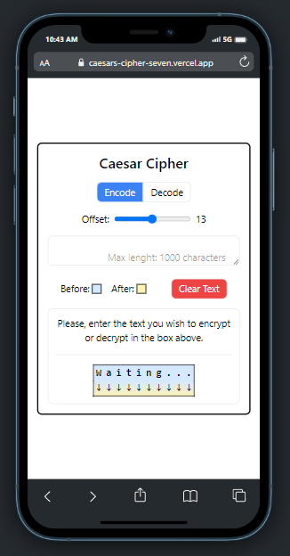

# Demo Website:

### You can try a live demo of this code at: [https://caesars-cipher-seven.vercel.app/](https://caesars-cipher-seven.vercel.app/)

# What is a Caesar Cipher?

One of the simplest and most widely known ciphers is a Caesar cipher, also known as a shift cipher. In a shift cipher the meanings of the letters are shifted by some set amount.

# My visual representation of the Caesar cipher:

As part of one of FreeCodeCamp's 300 hour course training projects, I was challenged to program a ROT13 algorithm, in which letters are swapped for 13 places, so that "A" becomes "N", just like "B " becomes "O", and so on. A

Apesar de ter resolvido com facilidade o desafio, fiquei interessado em demonstrar para outras pessoas e para isso precisava que ele fosse mais visual, com isso tive a idéia de desenvolver uma página bem simples e direta como proof of concept.

Despite having easily solved the challenge, I was interested in demonstrating it to other people and for that it needed to be more visual, so I had the idea of developing a very simple and easy to use page as proof of concept.

I was also careful to adjust and test on all screen sizes so that it was responsive to the devices used to visualize my project.

# Technologies used:

  

In the development of this project I chose to use the combination of React + Vite + Tailwind (Hosted at Vercel), aiming at production and development agility.
